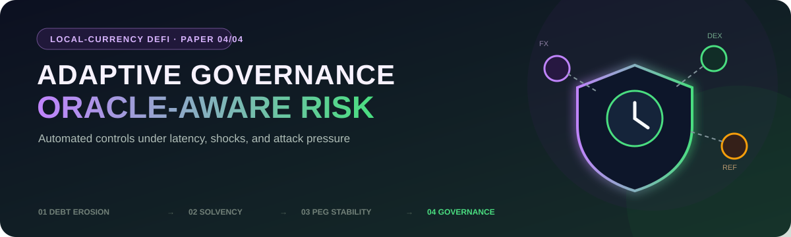
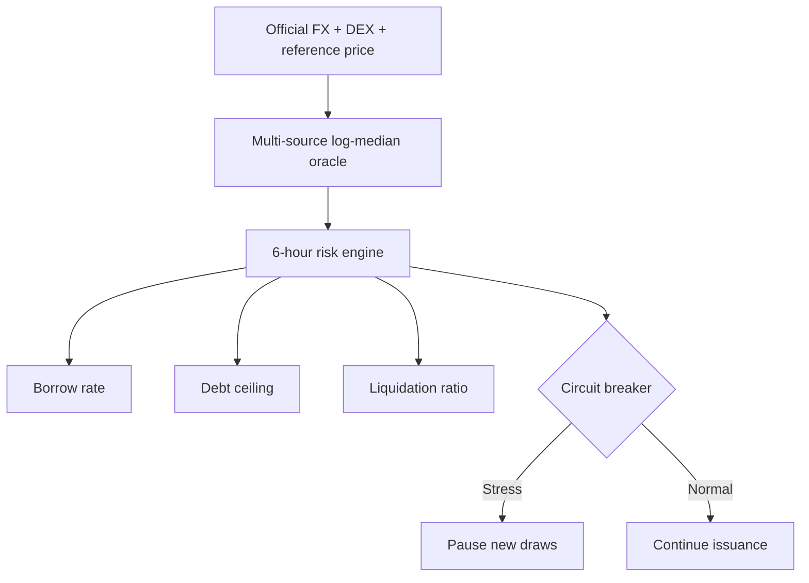

<p align="center">
  
</p>

<h1 align="center">Adaptive Governance, Oracle Latency, and Automated Risk Engine Design</h1>

<p align="center">
  <strong>For Local-Currency DeFi Lending Protocols</strong><br>
  Niko Rokni Lamouki · Salma Soofiyan · Amin Karami
</p>

<p align="center">
  
  
  
  
</p>

<p align="center">
  <a href="manuscript/main.pdf"><strong>Read the paper</strong></a> ·
  <a href="#reproduce"><strong>Reproduce the analysis</strong></a> ·
  <a href="#research-series"><strong>Explore the series</strong></a>
</p>

---

## At a glance

| Research question | Empirical base | Main contribution |
|---|---|---|
| Can an automated risk engine react to oracle error, joint shocks, and DEX pressure quickly enough to protect solvency without eliminating useful credit? | Official FX, DEX and reference-price signals, 39 realised windows, and 6,000 four-month bootstrap paths per currency and architecture | A latency-aware comparison of static governance, delayed DAO action, bounded automation, multi-source oracles, and circuit breakers |

> [!IMPORTANT]
> This is a counterfactual protocol-design experiment. It tests simulated governance architectures under stated assumptions; it is not an audit, a deployment recommendation, or evidence from a live ARS- or TRY-denominated lending protocol.

## Control architecture



- **Oracle comparison:** three-source log-median architecture versus a fragile single source.
- **Risk state:** EWMA volatility, DEX basis, source disagreement, and utilisation.
- **Bounded control:** rate-limited borrowing rate, debt ceiling, and liquidation-ratio changes.
- **Circuit breaker:** pauses new draws while retaining repayment and collateral top-up paths.
- **Governance latency:** 48-hour DAO baseline with a 0–72 hour delay sensitivity grid.
- **Adversarial demand:** opportunistic borrowing attacks during periods of stale or distorted prices.
- **Evaluation:** 6,000 four-month moving-block paths per currency and architecture, 39 realised windows, seed `20260810`, and a six-hour simulation clock.

## Key findings

| Outcome | ARS | TRY |
|---|---:|---:|
| Static architecture — paths with bad debt | 15.4% | 14.0% |
| Full architecture — paths with bad debt | 0.28% | 0.20% |
| Severe DEX discount under static / 48h DAO | 100% | 100% |
| Severe DEX discount under full architecture | 0% | 25% |
| Breaker active share | 28.0% | 29.1% |
| Issuance retained under full architecture | 0.20–0.22 of baseline | 0.20–0.22 of baseline |

Attack intensity exposes the value of layered controls: raising attack magnitude from 0 to 2× increases the static system's bad-debt incidence from 14.4% to 20.4%, while the multi-source-oracle plus breaker architecture remains at 0.33% in the pooled result.

The trade-off is explicit: protection improves sharply, but issuance falls from roughly 0.70 under the static baseline to 0.20–0.22 under the full architecture.

## Repository map

| Path | Contents |
|---|---|
| [`analysis/`](analysis/) | Oracle, controller, governance, attack, and path simulations |
| [`data/`](data/) | Included market inputs and prepared histories |
| [`results/`](results/) | Architecture and sensitivity outputs |
| [`tables/`](tables/) · [`figures/`](figures/) | Publication exhibits |
| [`tests/`](tests/) | Automated checks for the risk engine and workflow |
| [`manuscript/`](manuscript/) | LaTeX source and compiled paper |
| [`docs/`](docs/) | Data and replication documentation |

## Reproduce

Requirements: **Python 3.11+**, `pdflatex`, and Ghostscript.

```bash
python -m pip install -r requirements.txt
./run_all.sh
```

The workflow regenerates the simulations, sensitivity tables, figures, and compiled manuscript.

## Data window

- **Period:** January 2020 through July 2023.
- **FX:** official ARS and TRY series accessed through FRED/OECD.
- **Collateral:** Coin Metrics ETH/BTC histories inherited from the solvency calibration.

## Research series

| Paper | Focus | Repository |
|---:|---|---|
| 01 | Inflation-driven debt erosion | [inflation-driven-debt-erosion-defi](https://github.com/nikorokni/inflation-driven-debt-erosion-defi) |
| 02 | Joint FX and collateral shocks → protocol solvency | [local-currency-defi-solvency-stress-test](https://github.com/nikorokni/local-currency-defi-solvency-stress-test) |
| 03 | Liquidity and arbitrage constraints → peg stability | [local-currency-defi-peg-stability](https://github.com/nikorokni/local-currency-defi-peg-stability) |
| **04** | **Oracle latency and automated controls → adaptive governance** | **You are here** |

## Citation

> Rokni Lamouki, N., Soofiyan, S., & Karami, A. (2026). *Adaptive Governance, Oracle Latency, and Automated Risk Engine Design for Local-Currency DeFi Lending Protocols.*

## License

Analysis code and original repository text are released under the MIT License. Third-party data remain subject to their original source terms.

